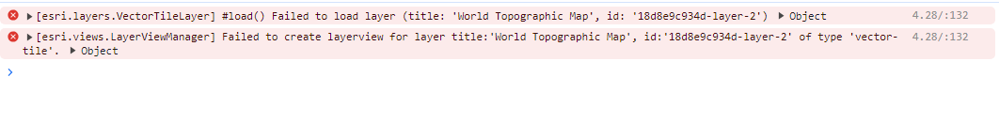
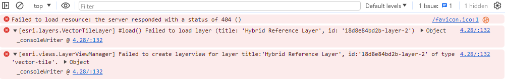
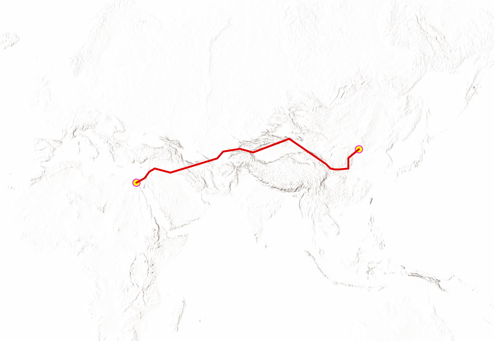

BUG REPORT

ArcGis TOPOGRAPHIC Base Map is not loading

Status of the isseue: On hold (investigating)

Description:
When the refferer is added along with the API key the ArcGIS topographic basemap does not show. It shows console error.
Only the zoom options are shown when loading the page.

Steps to reproduce the bug

Use Organization account to create API
Use API to create the map
Use arcgid-topographic

Expected result:
A plain map is produced without the map and only zoom option 
Error Details:
These were the following errors observed as map was loaded 

Settings used:
Google Chrome, Visual StudioCode and Github was used for the map.

Reproducing error:
Error can be produced if we add API key, refferer and the topographic basemap

